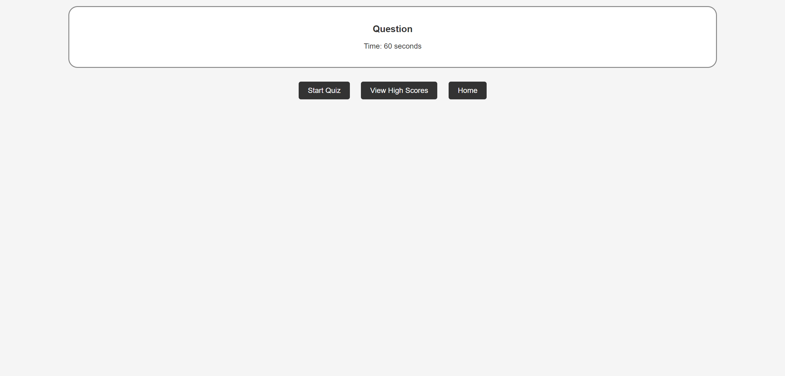

# Usama's Quiz

## Table of Contents

- Description
- Link
- User Story
- Deployed link

## Description

This project showcases the use of JavaScript, HTML, and CSS while showcasing an original take on interactive tests. It is a great option for both leisure and 
education because of its beautiful and user-friendly UI.

Put your knowledge of geography to the test by answering questions on the capital cities of other nations. Your task is to choose the proper capital out of the 
multiple-choice alternatives shown for each question. There's pressure to respond to as many questions as you can in the allotted time, while a timer is 
counting down.

Keep track of your score and turn in your initials at the end of the test to preserve your top score. Friends can even compete to see who can name their 
capital city the best. Look into the high scores as well.

## Link

You can view the webiste by the following link: 
 file:///C:/Users/uabdu/OneDrive/Desktop/Week-4-Quiz-Usama/index.html

## User Story 

The user that comes across this website will be able to take a quiz and will be able to keep track of their high score.

# Deployed Link

## Screenshot of website 
